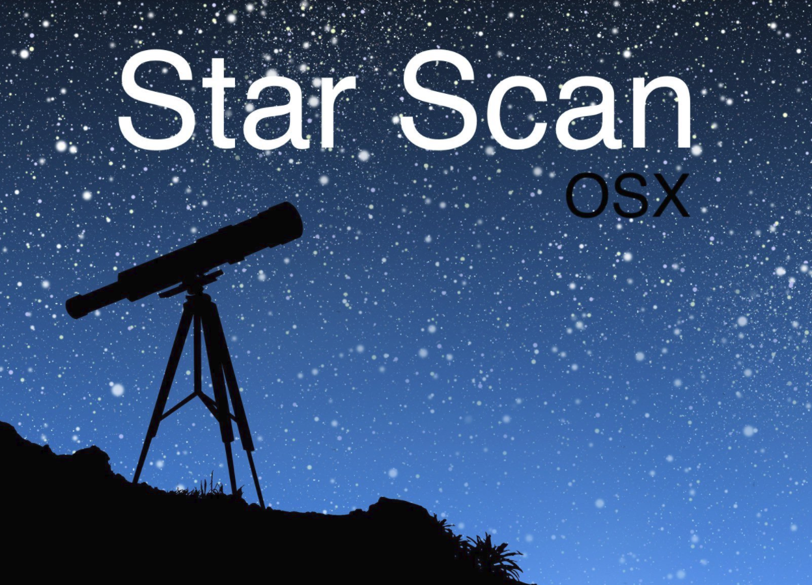
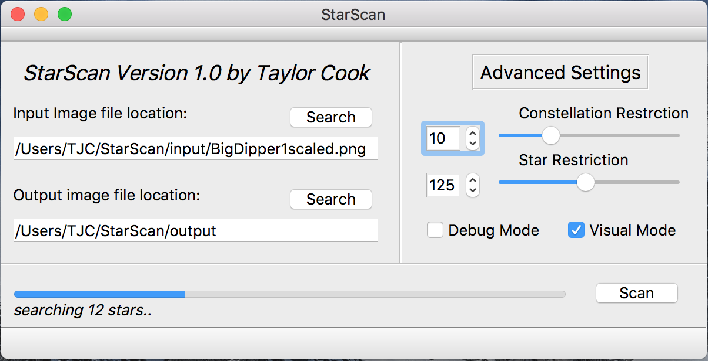

# 
#
# 
********************************************************************
*To identify stars and constellations in the night sky...*
********************************************************************
Link to Documentation: https://docs.google.com/presentation/d/13Bdzy6GP_IiHa_QVBSqyVurXQltCo3bKxevRx_Wp8hI/edit?usp=sharing

Task: Application designed to locate/identify constellations in an image of the night sky

Target Platform: OSX High Sierra 10.13.3 (only tested on this OS)

Language: C++ utlizing OPENCV/Qt

CAPSTONE PROJECT CS 498

By: Taylor Cook

Professor: Dr. Reale

School: SUNYPOLY

Semester: SPRING 2018

HOW TO COMPILE & RUN:
- Compiling can be tricky because the project requires both the Qt library(for the GUI) and OPENCV library(for..OpenCV). 

If you want to run the program without the GUI:
1. Make sure to install OpenCV libraries
2. The GUI-less version can be ran by using CMake on the root directory (/StarScan)
3. After a project file has been created by using CMake, run the program with your method of choice. 
I personally use Xcode to develop and run. (same basic program..except the ease of use goes down because to custom run the program you have to use command line arguments...)

GUI VERSION:
Helpful guide for setting up OpenCV/Qt on macOS: https://www.learnopencv.com/configuring-qt-for-opencv-on-osx/

If you have the installed dependancies (Qt and OpenCV) you can simply:

1. Navigate to /StarScan/StarScanGUI/
2. Enter command: "qmake"
3. Enter command: "make"
4. To run the complied program: "open *app"

If you do not have the installed dependancies and can get them here:
- https://www.qt.io/download (Qt)
- https://opencv.org/releases.html (OpenCV)
